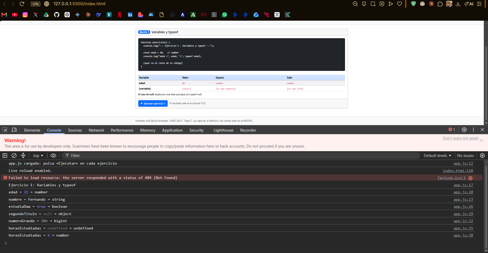
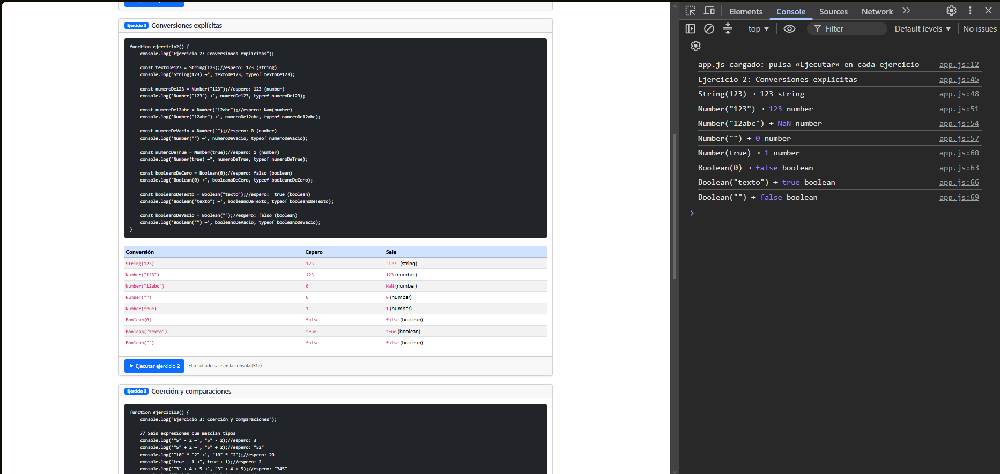
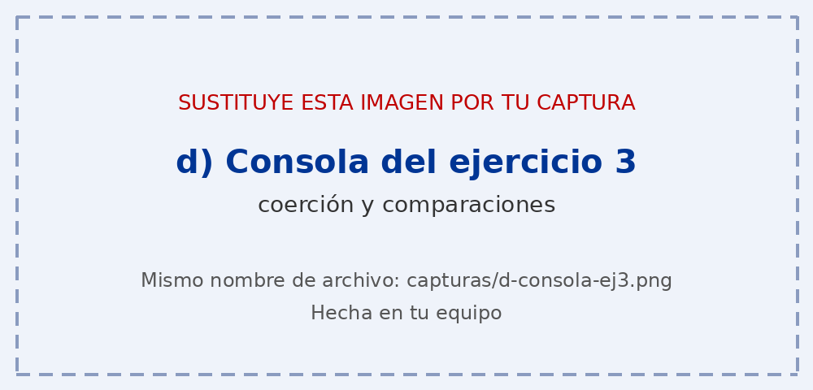
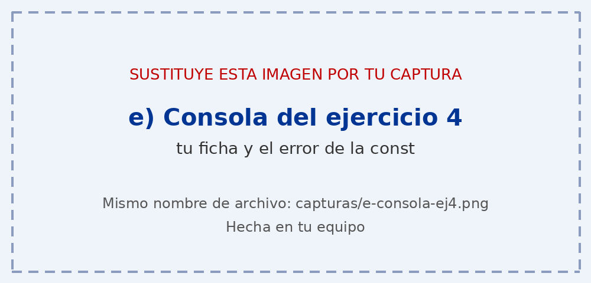

# Tarea 3 · Variables, tipos y conversiones

**Autor:** Fernando José García Fernández · Desarrollo Web en Entorno Cliente (DWEC) · 2.º DAW · Curso 2026-27

Esta carpeta contiene una página con cuatro ejercicios de JavaScript: variables y `typeof`, conversiones explícitas, coerción y comparaciones, y una ficha con plantillas de cadena. Para probarla, abro la carpeta en VS Code, pulso **Go Live**, abro la consola con F12 y pulso «Ejecutar» en cada ejercicio.

## Capturas

### a) La página entera

Se ve mi nombre en la navbar, las cuatro cards con su código y sus tablas «Espero / Sale», y el pie de página.

Enlace: https://github.com/FernandoGarcia-medac/DWEC/blob/main/tema03/capturas/a-pagina.png

### b) Consola del ejercicio 1

La consola muestra el valor y el `typeof` de cada variable. `segundoTitulo` (null) da `object`, y `horasEstudiadas` pasa de `undefined` a `number`.

Enlace: https://github.com/FernandoGarcia-medac/DWEC/blob/main/tema03/capturas/b-consola-ej1.png

### c) Consola del ejercicio 2

Las ocho conversiones con su resultado y su tipo. Destacan `Number("12abc")`, que da `NaN`, y `Number("")`, que da `0`.

Enlace: https://github.com/FernandoGarcia-medac/DWEC/blob/main/tema03/capturas/c-consola-ej2.png

### d) Consola del ejercicio 3

Las seis expresiones que mezclan tipos y las tres parejas comparadas con `==` y con `===`. Por ejemplo, `"5" + 2` da `"52"` y `0 == false` da `true`, pero `0 === false` da `false`.

Enlace: https://github.com/FernandoGarcia-medac/DWEC/blob/main/tema03/capturas/d-consola-ej3.png

### e) Consola del ejercicio 4, con el error de la const

La ficha hecha con plantilla de cadena y con `+`, la comparación con `===` que da `true`, y el error `Assignment to constant variable` al intentar cambiar una `const`.

Enlace: https://github.com/FernandoGarcia-medac/DWEC/blob/main/tema03/capturas/e-consola-ej4.png

## Reflexión

-Las conversiones más intuitivas fueron las de Boolean: Boolean(0) y Boolean("") dan false, y Boolean("texto") da true.
-También me pareció lógico que Number("123") dé 123 y que String(123) dé "123".
-Me sorprendió que Number("") dé 0 y que Number("12abc") dé NaN aunque empiece por números.
-El ejercicio 3 fue el más complicado: "5" + 2 da "52", pero "5" - 2 da 3.
Con el + manda la cadena y con el - manda el número, y por eso "3" + 4 + 5 da "345".
-He entendido por qué conviene usar ===: 0 == false da true, pero 0 === false da false.
Así evito comparaciones que me engañen.

## Fuentes

- [MDN Web Docs: operador typeof](https://developer.mozilla.org/es/docs/Web/JavaScript/Reference/Operators/typeof)
- [MDN Web Docs: JavaScript](https://developer.mozilla.org/es/docs/Web/JavaScript)

## Uso de IA

He usado **Claude** y **Gemini** para orientarme en los pasos de la tarea, resolver dudas (por ejemplo, un error al cargar `app.js`) y obtener el código base de los ejercicios 2, 3 y 4, la estructura del `index.html` y algunas frases de explicación. También he consultado la documentación de MDN Web Docs. Después de cada respuesta he mirado el código, lo probé en el navegador, escribí mis predicciones antes de ejecutar y corregí erratas.